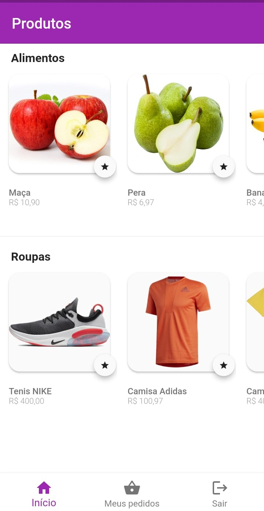

<h2>📖 Sobre</h2>


<p>Neste repositório foi implementado o mesmo exemplo de aplicação, utilizando duas tecnologias: Flutter e React Native. A ~~aplicação~~c que tem o foco de ser um e-commerce. Contendo um login, uma página de seleção de produtos, um carrinho de compras, e uma página para gerarmos um PDF.<br>
</p>

---

<h2>📱 Preview</h2>

   <p align="center">
      
      
      
      
   </p>

---

<h2>🤔 Como usar</h2>

   ```
   Configure o ambiente de desenvolvimento na sua máquina:
   https://flutter.dev/docs/get-started/install

   - Clone o repositório:
   $ git clone https://github.com/oapmartins/e-commerce_framework

   - Entre no diretório:
   $ cd e-commerce_framework

   - Instale as dependências:
   $ flutter pub get

   - Execute:
   $ flutter run
   ```

---

<h2>💪 Como contribuir</h2>

   ```
   - Fork o projeto 

   - Cria uma nova branch com suas mudanças:
   $ git checkout -b my-feature

   - Salve suas mudanças e faça uma mensagem de commit message sobre suas alterações:
   $ git commit -m "feature: My new feature"

   - Envie suas mudanças:
   $ git push origin my-feature
   ```
   ---
